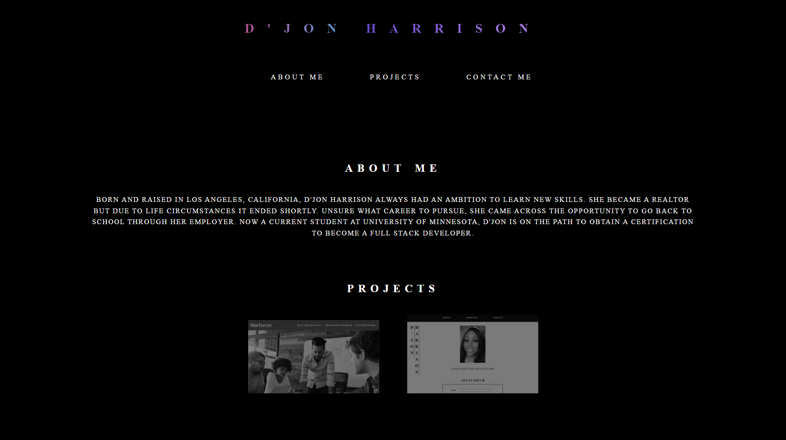

## Name

Portfolio for future employers.

## Description

A webpage built to display skill sets for a full stack development career. This webpage not only displays skills but also a short summary of the developer. Futhermore, the developers projects are listed along with links to the developers outside portfolios.

## Badges

## Visuals

## Usage

Starting at the top of the page, the user has access to navigation links. These links will help you to quickly maneuver to the topic you would like to view. The navigation links has hover affect for the users visual aspects of which links is being chosen. 

[Life Of A New Coder (1).webm](https://user-images.githubusercontent.com/113325442/199606981-4f0aa689-8b07-4e07-a257-4c3a5476b4ce.webm)

Project images also have a hover affect, giving the images a aesthetic appeal with the knowledge of what image is being chosen. 

[Life Of A New Coder Project demo.webm](https://user-images.githubusercontent.com/113325442/199608809-379ee152-b800-4b1c-9fb4-a40105abb917.webm)

A contact form can be found for future employers or developers looking to collaborate.

More navigation links at the bottom of page, which links to the developers Github and Linkedin profiles.

[Life Of A New Coder Profile demo.webm](https://user-images.githubusercontent.com/113325442/199608614-0c3e280f-4ad2-4f0e-85c8-6f7ac70a6776.webm)

## Support
If you come across a bug or just have any feedback, support can be contacted at DJonHarrison94@gmail.com!

## License
MIT License

Copyright (c) 2022 DJonJasmine

Permission is hereby granted, free of charge, to any person obtaining a copy
of this software and associated documentation files (the "Software"), to deal
in the Software without restriction, including without limitation the rights
to use, copy, modify, merge, publish, distribute, sublicense, and/or sell
copies of the Software, and to permit persons to whom the Software is
furnished to do so, subject to the following conditions:

The above copyright notice and this permission notice shall be included in all
copies or substantial portions of the Software.

THE SOFTWARE IS PROVIDED "AS IS", WITHOUT WARRANTY OF ANY KIND, EXPRESS OR
IMPLIED, INCLUDING BUT NOT LIMITED TO THE WARRANTIES OF MERCHANTABILITY,
FITNESS FOR A PARTICULAR PURPOSE AND NONINFRINGEMENT. IN NO EVENT SHALL THE
AUTHORS OR COPYRIGHT HOLDERS BE LIABLE FOR ANY CLAIM, DAMAGES OR OTHER
LIABILITY, WHETHER IN AN ACTION OF CONTRACT, TORT OR OTHERWISE, ARISING FROM,
OUT OF OR IN CONNECTION WITH THE SOFTWARE OR THE USE OR OTHER DEALINGS IN THE
SOFTWARE.
